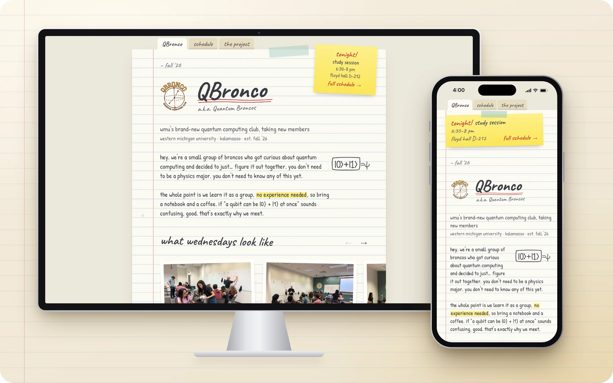

<p align="center">
  
</p>

<h1 align="center">QBronco website</h1>

<p align="center">
  The website for <strong>QBronco</strong> (the <strong>Quantum Broncos</strong>), Western Michigan University's quantum computing club.<br>
  <a href="https://qbronco.com"><strong>qbronco.com</strong></a>
</p>

<p align="center">
  
</p>

The site is one sheet of college-ruled paper, written in pencil. A sticky note on every page always shows the next meeting. It works that out in the visitor's browser, in Kalamazoo time, so nobody has to update it by hand each week.

| Page | What's on it |
| :-- | :-- |
| [`/`](https://qbronco.com) | What the club is, photos from meetings, how to join, the next few Wednesdays, the officers |
| [`/schedule`](https://qbronco.com/schedule) | Every meeting for the year, with past weeks crossed off, plus calendar subscribe links |
| [`/project`](https://qbronco.com/project) | This year's build, a quantum circuit compiler, and its three subteams |

## Quick start

You need [Node.js](https://nodejs.org) 22.12 or newer.

```sh
npm install
npm run dev        # http://localhost:4321, reloads as you edit
```

| Command | What it does |
| :-- | :-- |
| `npm run dev` | Local dev server at `localhost:4321` |
| `npm run build` | Builds the site into `dist/` |
| `npm run preview` | Serves the built `dist/` to check it before deploying |
| `npm test` | Builds the site and runs the Playwright tests (see [Testing](#testing)) |
| `npm run og` | Rebuilds the link-preview image, `public/og.jpg` |
| `npm run icons` | Rebuilds the favicons and home-screen icons |
| `npm run screenshots` | Retakes the picture at the top of this README |
| `npm run officer-photo` | Crops a new officer's headshot (see [Adding an officer](docs/adding-an-officer.md)) |
| `npm run officers-screenshot` | Screenshots the officers section at desktop and phone widths, to check a change |

## Updating the site

Almost everything the site says comes from two data files in `src/data/`. Change those and every page, the calendar feed and the search data follow along.

### Meeting dates: `src/data/schedule.ts`

Each Wednesday gets one row:

```ts
{ date: "2026-10-28", title: "lab 2", kind: "lab" },
{ date: "2026-11-18", title: "Qubi workshop 1", kind: "event", proposed: true },
{ date: "2026-11-25", title: "thanksgiving", kind: "off" },
{ date: "2026-09-16", title: "info night", kind: "event", room: "D-202" },
```

- `date` is the Wednesday, as `YYYY-MM-DD`.
- `title` is written the way it appears on the page (lowercase pencil, apart from names like Qiskit).
- `kind` is one of:
  - `lab`
  - `study`
  - `event`
  - `off`, meaning no meeting that week; the title says why
- Optional fields:
  - `proposed: true` adds "(proposed)" because the date isn't locked in yet
  - `room` is set only when it isn't the usual room
  - `about` adds a red star and a footnote on the schedule page

Set `UPDATED` at the top of the file to the day you edit it, since the schedule page shows it. The usual time and room are in `MEETING`, and the full street address for maps and calendars is in `PLACE`.

For a new school year, add a term to `TERMS`. Mark it `tentative: true` while its dates can still move.

From that one file, the site builds:

- the sticky note
- the schedule page
- the "coming up" list on the home page
- the calendar feed at `/qbronco.ics`
- the schema.org events Google reads
- `llms.txt`

### Officers, photos and links: `src/data/people.ts`

- **Club links and the sign-up form** are in `CLUB`. The other names the club goes by (`alsoKnownAs`) are what make a search for "Quantum Broncos" find the site.
- **Officers** are in `OFFICERS`, in display order. Step-by-step guide: [docs/adding-an-officer.md](docs/adding-an-officer.md).
  - Each needs a square headshot saved twice: `public/officers/<photo>-160.webp` and `-320.webp`.
  - `tilt` is the small angle each photo is pinned at, set by hand so the row doesn't look stamped out.
- **The photo reel** is `REEL`, newest first:
  - Every print is 4:3, saved at three widths: `public/reel/<photo>-320.webp`, `-480.webp` and `-640.webp`.
  - Write `alt` text that describes the photo for someone who can't see it.

With [ImageMagick](https://imagemagick.org) installed (the command is `magick` on v7, `convert` on v6), this crops and sizes a photo:

```sh
# a reel photo: 4:3, three widths
for w in 320 480 640; do
  h=$((w * 3 / 4))
  magick photo.jpg -resize "${w}x${h}^" -gravity center -extent "${w}x${h}" \
    -quality 80 "public/reel/my-photo-$w.webp"
done

# an officer headshot: square, two sizes
for w in 160 320; do
  magick headshot.jpg -resize "${w}x${w}^" -gravity center -extent "${w}x${w}" \
    -quality 80 "public/officers/first-last-$w.webp"
done
```

`-gravity center` crops evenly from both sides. If faces end up cut off, crop the original by hand first.

### Images made by scripts

| File | Made from | Command |
| :-- | :-- | :-- |
| `public/og.jpg`, the 1200×630 link preview | `scripts/og/card.html` + `scripts/og/photo.jpg` | `npm run og` |
| `favicon-32.png`, `favicon.ico` | `public/favicon.svg` | `npm run icons` |
| `icon-192.png`, `icon-512.png` (home-screen icons) | `public/logo_transparent.png` | `npm run icons` |
| `docs/screenshots/home.webp`, the picture at the top of this README | the built site, framed by `scripts/readme/devices.html` | `npm run screenshots` |
| `public/officers/<slug>-160.webp`, `-320.webp` (officer headshots) | any photo of them | `npm run officer-photo` |

## How it's built

[Astro](https://astro.build) builds plain static HTML, styled with [Tailwind CSS](https://tailwindcss.com) v4 and a hand-written theme. The only JavaScript is one small inline script. It moves the sticky note and the schedule along as the weeks pass, and the pages still read correctly without it.

```text
src/
├── data/
│   ├── schedule.ts         every meeting date, the room and the time
│   ├── people.ts           club links, officers, the photo reel
│   └── llms.ts             the plain-text versions for AI assistants
├── layouts/
│   ├── Base.astro          <head>: titles, link previews, structured data, icons
│   └── Notebook.astro      the paper, the tabs, the sticky note and its script
├── components/             WeekRow, Reel, Officers
├── pages/
│   ├── index.astro         /
│   ├── schedule.astro      /schedule (and /calendar redirects here)
│   ├── project.astro       /project
│   ├── 404.astro
│   ├── qbronco.ics.ts      the calendar feed
│   ├── llms.txt.ts         /llms.txt and /llms-full.txt
│   ├── llms-full.txt.ts
│   ├── sitemap.xml.ts
│   └── site.webmanifest.ts
└── styles/global.css       the notebook theme
public/                     photos, icons, og.jpg, robots.txt
scripts/                    the image generators (see the table above)
tests/                      Playwright specs
docs/                       step-by-step guides (start at docs/README.md)
```

A few design rules hold the look together:

- **Everything sits on the lines.** Every vertical measurement (line heights, margins, padding) is a multiple of `--rule-gap`: 28px on desktop, 26px on phones. That way the handwriting always lands on the blue rules. If you change spacing in `global.css`, keep to those multiples; a test checks it.
- **Two handwriting fonts, both self-hosted.** Caveat for headings and Patrick Hand for body text, served from this site and preloaded. There are no Google Fonts requests.
- **Pencil on the page, proper case for machines.** The page writes "floyd hall D-212" in lowercase. The calendar feed, search data and `llms.txt` write "Floyd Hall D-212". The helpers in `schedule.ts` handle the conversion.

## Search, link previews and AI assistants

So that people can find the club under either name, and so that links and assistants get the facts right, each page includes:

- **Both names** ("QBronco" and "Quantum Broncos") in titles, descriptions and the a.k.a. under the wordmark, plus `WebSite` and `Organization` structured data with `alternateName`.
- **Open Graph and Twitter cards** with a 1200×630 photo card (`og.jpg`), so shared links get a proper preview. Its URL ends in a fingerprint of the file (`og.jpg?v=…`, from `src/data/card.ts`), so after `npm run og` makes a new card, apps fetch it instead of reusing a copy of the old one.
- **schema.org `Event`** data for every meeting on `/schedule`.
- **[`/llms.txt`](https://qbronco.com/llms.txt)** and **[`/llms-full.txt`](https://qbronco.com/llms-full.txt)**: the whole site in plain text for AI assistants, built from the same data as the pages.
- **[`/qbronco.ics`](https://qbronco.com/qbronco.ics)**, a calendar feed. Subscribers see date changes on their own.
- `robots.txt`, `sitemap.xml`, an SVG favicon that switches for dark mode, and a web app manifest for "Add to Home Screen".

## Testing

```sh
npx playwright install chromium   # once, to download the test browser
npm test
```

`npm test` builds the site, serves it on port 4322, and runs every spec twice: at desktop width and on a Pixel 7. Tests that depend on the date freeze the browser clock, so they pass on any day of the year.

| Spec | Covers |
| :-- | :-- |
| `next-meeting.spec.ts` | The sticky note: tonight, happening now, next week, skipped weeks, other time zones, no JavaScript |
| `schedule.spec.ts` | The schedule page, the coming-up list, the calendar feed |
| `schedule-data.spec.ts` | Every date is a Wednesday, in order, with 6:30–8 pm right on both sides of daylight saving |
| `people.spec.ts` | The officers, the photo reel and its arrows, the subteam photos |
| `layout.spec.ts` | Text on the ruled lines, no sideways scrolling, the tabs, keyboard focus, the `/calendar` redirect |
| `discovery.spec.ts` | Titles, structured data, link previews, llms.txt, sitemap, fonts, icons, the manifest |

## Hosting

The site is hosted on [Vercel](https://vercel.com), which builds it with `npm run build` and serves `dist/`. `vercel.json` sets the cache headers and the content types for `llms.txt` and the manifest.

---

<p align="center">
  <a href="https://docs.google.com/forms/d/e/1FAIpQLSe83Y5m_jP0qmOiVQPctybcPf4Zsvg5W58nT5T5oSlPOoQucA/viewform">Join the club</a>
  ·
  <a href="https://www.instagram.com/qbroncowmu/">Instagram</a>
  ·
  <a href="https://experiencewmu.wmich.edu/organization/qbroncos">experienceWMU</a>
  ·
  <a href="https://www.linkedin.com/company/qbronco">LinkedIn</a>
  ·
  <a href="https://github.com/qbronco">GitHub</a>
</p>
